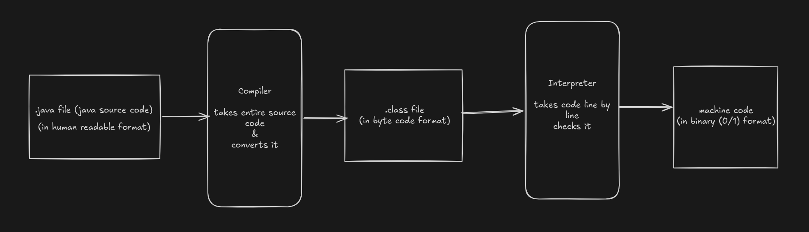
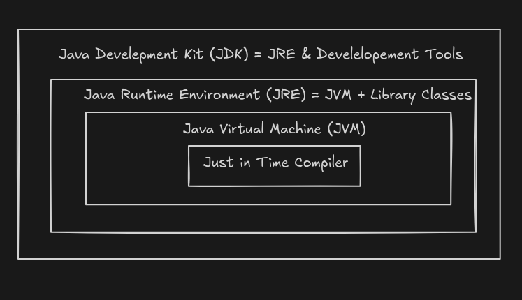
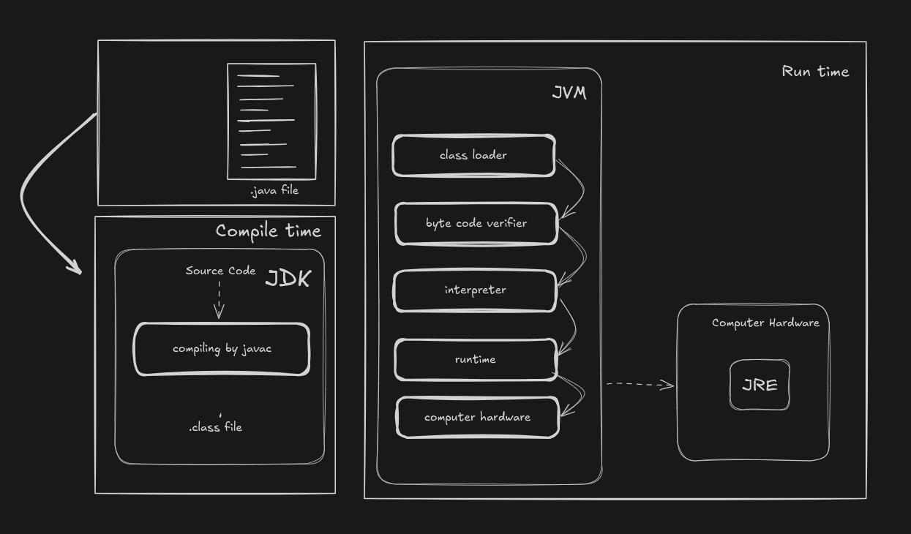

# 01 Introduction To Java 

## How Java Code Executes

- Steps
    1. You write a `.java` file (human-readable code).
    2. JVM Compiler (`javac`) reads the whole file and converts it into a `.class` file (bytecode).
    3. JVM Interpreter reads and executes the bytecode in `.class` file line-by-line to produce machine code (0s and 1s) for the CPU. 
    4. Machine code final code that will execute on machine, process the data / task and generate the output. 

## Platform Independence of Java

- Platform independenc01_IntroductionToJavae is the ability of a program to run on different operating systems without modifying the source code.
- In other dependent languages like C++, we have to entirely recompile the code for each target platform (Windows, Linux, Mac) because the compiled executable is platform-specific.
- But in Java, we take source code, compile it to create byte code (.class file), which can run on any machine where JVM is installed.
- This gives the code platform independence to Java.

## Java architecture

### Java Development Kit (JDK)

- It is a packaged JRE with tools that help to write code and is used by developers.
- It includes:
    1. JRE : tools to run the java program
    2. Java compiler (javac) - translates source code into bytecode (.class files).
    3. Java loader and interpreter - loads classes and executes bytecode line by line.
    4. Development tools (debugger, etc.) - utilities for testing, profiling, and troubleshooting code.
    5. Java archiver (jar) - packages class files and resources into a single compressed archive.
    6. Documentation generator (javadoc) - creates API documentation from source code comments.

### JRE (Java Runtime Environment)

- It is installation package that provides environment to run the program.
- It consists of:
    1. Deployment technologies - tools for distributing and updating applications.
    2. User interface toolkits - libraries for building GUI components (e.g., AWT, Swing).
    3. Integration libraries - APIs for connecting to databases, networking, and other services.
    4. Base libraries - core Java packages (java.lang, java.util, I/O, etc.).
    5. JVM (Java Virtual Machine) - executes bytecode and manages memory/threads.
- After we get the .class file, the next happens at runtime:
    1. Class loader loads all classes needed to execute the program.
    2. JVM sends code to bytecode verifier to check the format of the code.

### Java program at Compile and Run time

#### Compile time
- `javac` receives the source code (.java files) and it for syntax and semantic errors during compilation.
- If errors exist, compilation fails and error messages are displayed.
- If not then `javac` 01_IntroductionToJavaparses source code, performs type checking, and generates bytecode instructions  in `.class` file
    
#### Runtime

- After compilation, the compiled bytecode (.class file) is received by the JVM.
- The class loader subsystem performs the following steps in order:

    1. Loading
        - Reads the .class file and generates binary data.
        - Creates the object of these classes as required in heap memory.
01_IntroductionToJava
    2. Linking
        - Verifies the .class file format and correctness.
        - Allocates memory for class variables and assigns default values according to their data types.
        - Replaces symbolic references with direct references.

    3. Initialization
        - All static variables are assigned the values defined in the code.
        - Static blocks are executed.

- After class loading, the program instructions in memory are executed:
    - The interpreter reads and executes bytecode line by line.
    - Frequently execu01_IntroductionToJavated code (hot spots) is passed to the JIT compiler, which produces direct machine code to avoid re-interpretation and improve performance.

- JVM also has a Garbage Collector that automatically removes objects no longer in use, freeing memory.

- After all checks, conversions, and loading are complete, the code starts executing and performs its intended functionality.
