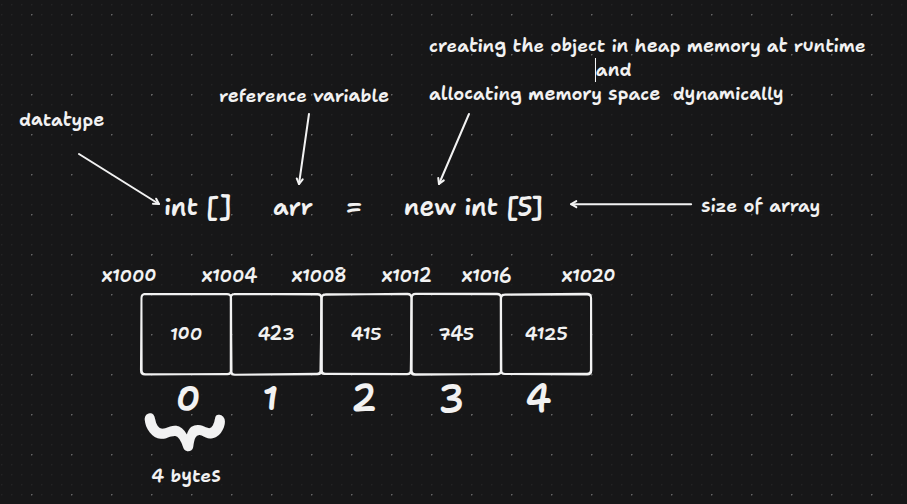

# Array and Array List in Java

## Arrays 

An array is a container for primitives or objects that holds a fixed number of values of a single type.

- Once type and size is defined then it can be changed
- Just initialized array contains Default values at every index based on type of (0 for int, null for objects)
- Length accessed using `length` property
- Index starts from 0 to `length-1` and loops can be used to iterate over them.
- Java arrays are logically contiguous from the programmer's perspective, but physical contiguity in memory is not guaranteed by the Java Language Specification and is managed by the JVM implementation.




### Declaration

```java syntax
// Declaration
type [] arrIdentifier;

// Declaration and initialization
type [] arrIdentifier = new type [arrSize];

// Declaration with values
type [] arrIdentifier = {value1, value2, value3, value4, value5};

// Accessing Elements
type value = arrIdentifier[index]

// Change value
arrIdentifier[index] = newValue;

// Iterate using for loop
for (int i = 0; i < numbers.length; i++) {
    System.out.println(numbers[i]);
}05_ArrayAndArrayList/ArraysIntenals.png

// Iterate using enhanced for loop
for (int num : numbers) {
    System.out.println(num);
}
```

### Multi-dimensional Arrays

```java
// 2D array
int[][] matrix = new int[3][3];

// With values
int[][] matrix = {
    {1, 2, 3},
    {4, 5, 6},
    {7, 8, 9}
};

// Access
System.out.println(matrix[1][2]); // 6

// Iterate 2D array
for (int i = 0; i < matrix.length; i++) {
    for (int j = 0; j < matrix[i].length; j++) {
        System.out.print(matrix[i][j] + " ");
    }
    System.out.println();
}
```

### Common Operations

```java
int[] arr = {5, 2, 8, 1, 9};

// Length
int len = arr.length;

// Sorting
Arrays.sort(arr);

// Copy
int[] copy = Arrays.copyOf(arr, arr.length);

// Print as string
System.out.println(Arrays.toString(arr));

// Binary search (sorted array)
int index = Arrays.binarySearch(arr, 8);
```

## Heap and Stack Memory in Java

### Stack Memory

- Stores method calls and local variables
- Each thread has its own stack
- Variables are created and destroyed automatically
- LIFO (Last In First Out) order
- Fast access
- Limited size
- Stores primitives and object references

### Heap Memory

- Stores all objects and arrays
- Shared across all threads
- Memory is managed by garbage collector
- Larger in size
- Slower access compared to stack
- Objects remain until garbage collected

### Key Differences

- Stack stores local variables and method calls
- Heap stores objects and instance variables
- Stack is thread-specific, heap is shared
- Stack has fixed size, heap is dynamic
- Stack follows LIFO, heap has no order

### Example

```java
public class MemoryExample {
    int instanceVar = 10; // stored in heap (inside object)
    
    public void method() {
        int localVar = 20; // stored in stack
        MyObject obj = new MyObject(); // reference on stack, object on heap
    }
}
```

## Array Index Out of Bounds Exception

### What It Is
- An exception thrown when attempting to access an array index that is outside the valid range

### When It Occurs
- When accessing an index less than 0
- When accessing an index greater than or equal to the array length

### Example
```java
int[] numbers = {10, 20, 30};
System.out.println(numbers[0]); // valid
System.out.println(numbers[3]); // error - index 3 out of bounds (length is 3)
System.out.println(numbers[-1]); // error - negative index
```

## Array of Objects

An array of objects is an array that stores references to objects of a specific class type. Each element in the array holds a reference to an object.

### Example with Car Class

```java
public class Car {
    String brand;
    String color;
    
    public Car(String brand, String color) {
        this.brand = brand;
        this.color = color;
    }
    
    public static void main(String[] args) {
        // Create array of Car objects with 3 indices
        Car[] cars = new Car[3];
        
        // Assign objects to each index
        cars[0] = new Car("Toyota", "Red");
        cars[1] = new Car("Honda", "Blue");
        cars[2] = new Car("BMW", "Black");
        
        // Access and print
        System.out.println(cars[0].brand); // Toyota
        System.out.println(cars[1].color); // Blue
    }
}
```

## Multi-dimensional Arrays in Java

A multi-dimensional array is an array of arrays. Each element of the main array is itself an array.

### Two-Dimensional Array

```java
// Declaration and initialization
int[][] matrix = new int[3][3];

// With values
int[][] matrix = {
    {1, 2, 3},
    {4, 5, 6},
    {7, 8, 9}
};

// Access
System.out.println(matrix[1][2]); // 6

// Iterate
for (int i = 0; i < matrix.length; i++) {
    for (int j = 0; j < matrix[i].length; j++) {
        System.out.print(matrix[i][j] + " ");
    }
    System.out.println();
}
```

### Jagged Array

A jagged array is a multi-dimensional array where each row has a different length.

```java
int[][] jagged = new int[3][];
jagged[0] = new int[2];
jagged[1] = new int[4];
jagged[2] = new int[3];

// Or with values
int[][] jagged = {
    {1, 2},
    {3, 4, 5, 6},
    {7, 8, 9}
};
```

### Three-Dimensional Array

```java
int[][][] cube = new int[2][3][4];

// Access
cube[0][1][2] = 10;

// Iterate
for (int i = 0; i < cube.length; i++) {
    for (int j = 0; j < cube[i].length; j++) {
        for (int k = 0; k < cube[i][j].length; k++) {
            System.out.print(cube[i][j][k] + " ");
        }
        System.out.println();
    }
    System.out.println();
}
```

### Key Points

- Multi-dimensional arrays are arrays of arrays
- Each inner array can have different lengths (jagged arrays)
- Indexing starts from 0 for each dimension
- Accessed using multiple index values

```java
int[][] matrix = new int[4][5]; // 4 rows, 5 columns
System.out.println(matrix.length); // 4 (number of rows)
System.out.println(matrix[0].length); // 5 (columns in first row)
```

> As arrays are also objects, when passed to a function, their reference is copied to the argument. So if a function changes anything using that reference, the original array gets modified.

## ArrayList in Java

- ArrayList is a resizable array implementation i.e. it can grow or shrink dynamically.
- Stores objects (non-primitive types)
- Dynamic size, grows automatically
- Allows duplicates
- Maintains insertion order
- Index-based access
- Not synchronized (not thread-safe)

### Declaration

```java syntax
import java.util.ArrayList;
ArrayList<Type> names = new ArrayList<>();
```

## ArrayList Internal Working

### Internal Process

- An array is created with the given initial capacity. If not specified, the default capacity is 10.
- Each time a new element is added, the `add()` method checks if the current capacity is sufficient.
- If capacity is insufficient, resizing occurs. The new capacity is calculated using the growth formula: `(currentSize * 3/2) + 1`.
- A new array with the increased capacity is created.Elements from the old array are copied to the new array using `System.arraycopy()`. and the old array becomes eligible for garbage collection.
- When adding or removing elements in the middle, elements shift, which is an `O(n)` operation.
- ArrayList maintains an internal size counter, and `trimToSize()` reduces capacity to the current size.

### Time Complexity

- add() - O(1) amortized, O(n) when resizing
- get() - O(1)
- remove() - O(n) due to shifting
- set() - O(1)

### Common Methods

```java   
ArrayList<String> list = new ArrayList<>();

list.add("Apple"); // Add at end
list.add("Banana");
list.add(1, "Orange"); // add at index

String fruit = list.get(0); // Access element at index

list.remove(0); // Remove by index
list.remove("Banana"); // Remove by object

int size = list.size(); // return the size or number of available elements

boolean contains = list.contains("Apple"); // Check where given element is preset or not
boolean empty = list.isEmpty(); // Checks where array is empty or not

// Iterate over array list using for loop
for (int i = 0; i < list.size(); i++) {
    System.out.println(list.get(i));
}

// Iterate over array list using enhanced for loop
for (String item : list) {
    System.out.println(item);
}

list.clear(); // Removes all the elements from array list
```

### Difference from Arrays

- Arrays have fixed size, ArrayList is dynamic
- Arrays can store primitives, ArrayList only stores objects
- Arrays use `length`, ArrayList uses `size()`
- Arrays are faster, ArrayList has overhead
